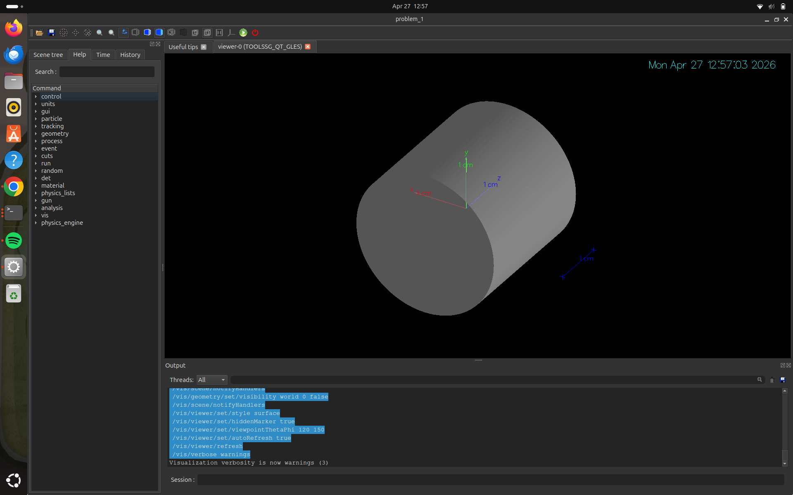
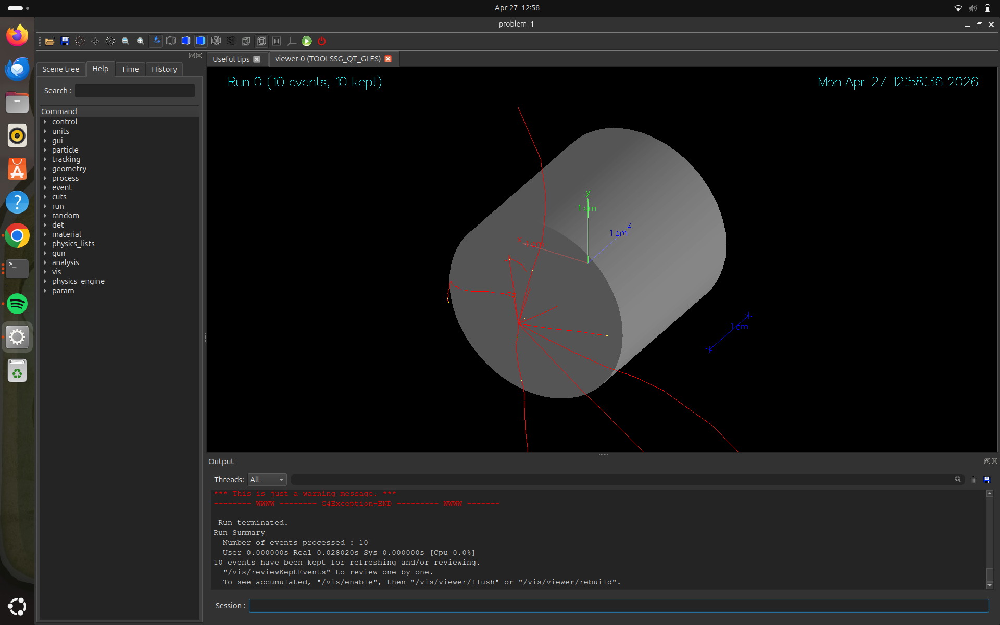
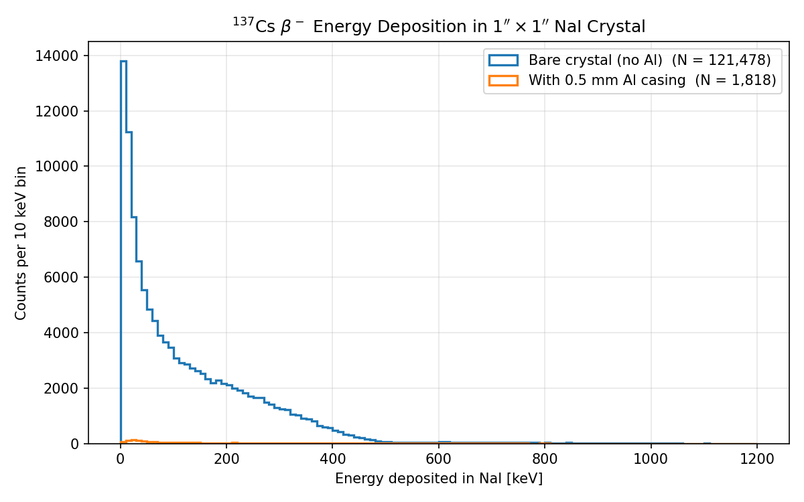
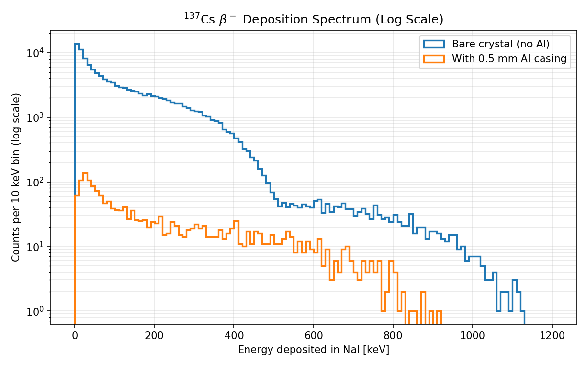
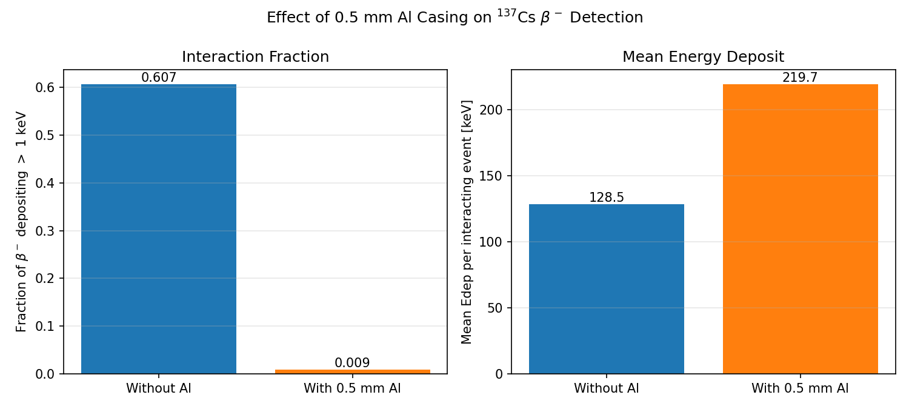

# Problem 1: Cs-137 Beta Deposition in NaI(Tl)

Simulation of Cs-137 beta-minus energy deposition in a 1″ × 1″ cylindrical NaI crystal, comparing a bare crystal against the same crystal encased in a 0.5 mm aluminium housing. The source is placed 5 mm in front of the crystal face on the cylinder axis.

## Geometry

- **Crystal:** NaI cylinder, radius = 12.7 mm, length = 25.4 mm (1″ × 1″).
- **Casing:** Tube wrapping the crystal on all sides with 0.5 mm wall thickness. Material is toggled between `G4_Al` (with-Al run) and `G4_AIR` (without-Al run) via the `/det/casing` UI command, so the crystal-to-source distance stays fixed at 5 mm.
- **Source:** Cs-137 β⁻ spectrum, sampled from the allowed Fermi shape (F = 1) with both branches: 94.7 % to T_max = 514 keV and 5.3 % to T_max = 1176 keV. Emitted into the forward 2π hemisphere from a point source 5 mm from the crystal front face.
- **Physics:** `FTFP_BERT` with `G4EmStandardPhysics_option4` (high-accuracy EM physics).

## Building the Project

```bash
mkdir -p build
cd build
cmake ..
make -j$(nproc)
```

## Running the Simulation

### Batch Mode

Two macros write energy-deposition ntuples (one row per primary) to `results/`:

```bash
./build/problem_1 run_with_al.mac
./build/problem_1 run_without_al.mac
```

Each runs 200,000 primaries and produces a CSV under `results/`:
- `results/results_with_al_nt_edep.csv`
- `results/results_without_al_nt_edep.csv`

### Interactive Mode (Visualization)

```bash
./build/problem_1
```




## Results

The 0.5 mm Al casing absorbs nearly all of the dominant 514 keV β⁻ branch (extrapolated range in Al ≈ 1.5 mm), so the interaction fraction in NaI drops by roughly two orders of magnitude. Only the high-energy tail from the minor 1176 keV branch survives the casing, which is why the *mean* energy deposited per surviving event is *higher* with the casing than without.

| Quantity                                  | Without Al | With 0.5 mm Al |
|-------------------------------------------|-----------:|---------------:|
| Primaries                                 |   200,000  |    200,000     |
| Fraction depositing > 1 keV               |   0.6074   |    0.0091      |
| Mean Edep per interacting event           |  128.5 keV |   219.7 keV    |

### Energy Deposition Spectrum



### Log-Scale Spectrum

The log scale makes the surviving high-energy tail visible for the with-Al case, and shows the sharp endpoint of the dominant 514 keV branch for the bare crystal.



### Summary Comparison



### Generating Plots

A Python script reads both ntuples and produces all plots in `results/`:

```bash
python3 plot_results.py
```

## Project Structure

- `src/`, `include/`: Simulation source code (snake_case convention).
- `main.cc`: Application entry point, wires detector and action initialization.
- `run_with_al.mac`, `run_without_al.mac`: Batch-mode macros for the two configurations.
- `init_vis.mac`, `vis.mac`: Visualization configuration.
- `plot_results.py`: Data analysis and plotting script.
- `results/`: Output directory holding ntuple CSVs and PNG plots.
