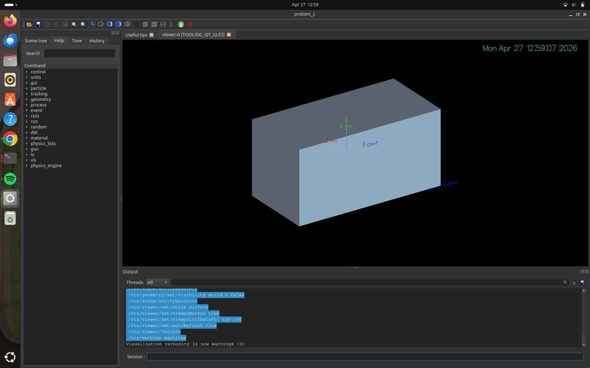
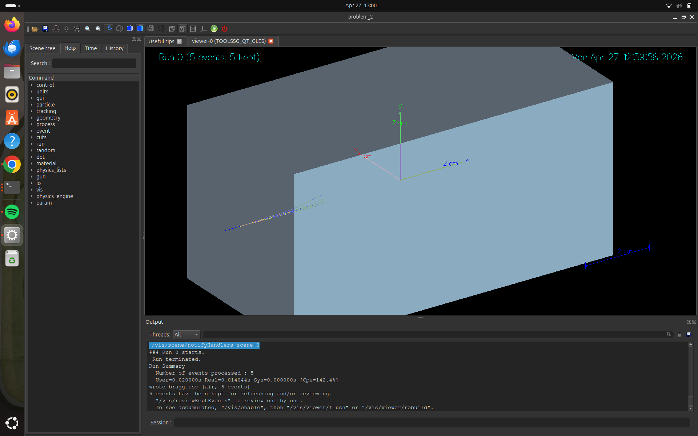
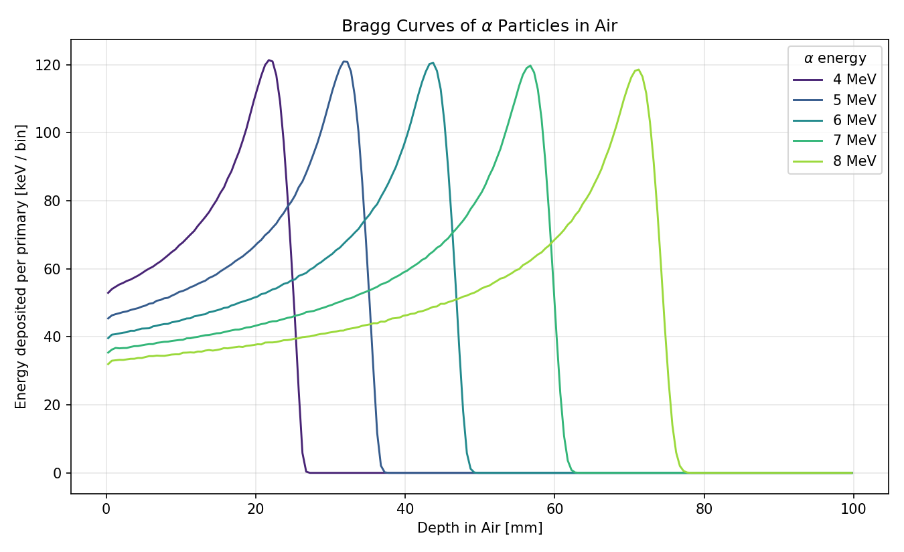
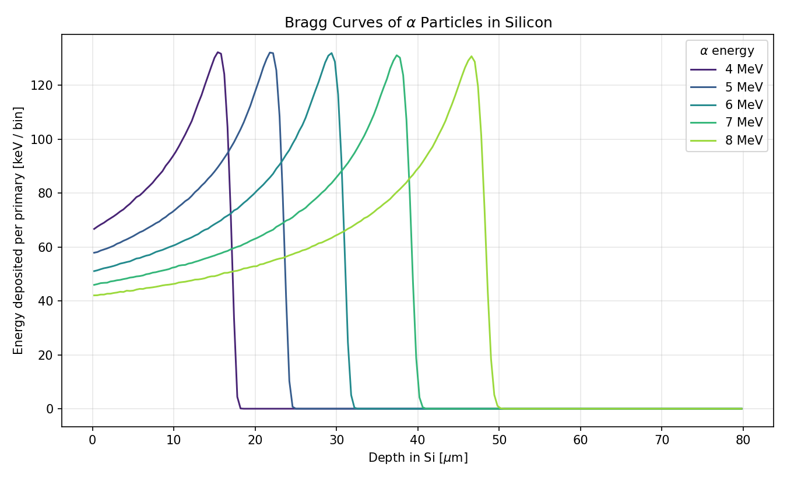
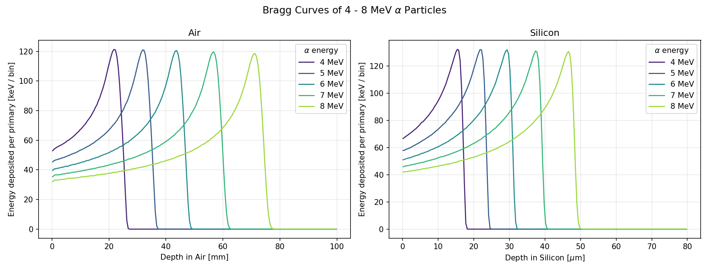

# Problem 2: Bragg Curves of Alpha Particles in Air and Silicon

Simulation of energy deposition (Bragg) curves for monoenergetic alpha particles at 4, 5, 6, 7, and 8 MeV traversing two absorbers: air and silicon.

## Geometry

A single rectangular absorber sits in vacuum. Material and dimensions are switched via the `/det/material` UI command:

| Material | NIST key  | Thickness | Transverse | Bin width |
|----------|-----------|----------:|-----------:|----------:|
| `air`      | `G4_AIR` | 100 mm    | 50 × 50 mm | 0.5 mm    |
| `silicon`  | `G4_Si`  | 80 µm     | 0.5 × 0.5 mm | 0.4 µm  |

Each run uses 200 longitudinal bins. A `G4UserLimits` step cap of `bin_width / 4` is enforced inside the absorber via `G4StepLimiterPhysics`, so multiple steps fall in every bin even near the Bragg peak. Physics: `FTFP_BERT` with `G4EmStandardPhysics_option4`.

The alpha gun fires from just outside the front face (z = -t/2) along +z, with energy set per run via `/gun/energy`.

## Building the Project

```bash
mkdir -p build
cd build
cmake ..
make -j$(nproc)
```

## Running the Simulation

### Batch Mode

Two macros sweep the five energies, writing one CSV per (material, energy) into `results/`:

```bash
./build/problem_2 run_air.mac
./build/problem_2 run_si.mac
```

Each `beamOn` is 5,000 alphas. The output filename for each run is set by `/io/output <path>` (no extension); the run action writes `<path>.csv` with two columns:

```
# depth_mm,edep_keV_per_event
0.25,53.21
0.75,53.78
...
```

### Interactive Mode (Visualization)

```bash
./build/problem_2
```




## Results

Each curve shows the characteristic ionisation profile: a slow rise as the alpha slows down, a sharp Bragg peak, then a fast cutoff at end of range. The peak heights are nearly constant across energies (~120 keV/bin in air, ~130 keV/bin in Si) because dE/dx near the end of range depends only weakly on initial energy.

| Material | E [MeV] | Peak depth | Peak Edep [keV / bin] |
|----------|--------:|-----------:|----------------------:|
| Air      | 4       | 21.75 mm   | 121.4                 |
| Air      | 5       | 31.75 mm   | 120.9                 |
| Air      | 6       | 43.75 mm   | 120.5                 |
| Air      | 7       | 56.75 mm   | 119.7                 |
| Air      | 8       | 71.25 mm   | 118.6                 |
| Silicon  | 4       | 15.4 µm    | 132.3                 |
| Silicon  | 5       | 21.8 µm    | 132.1                 |
| Silicon  | 6       | 29.4 µm    | 132.0                 |
| Silicon  | 7       | 37.4 µm    | 131.1                 |
| Silicon  | 8       | 46.6 µm    | 130.8                 |

The ranges agree with published NIST ASTAR / SRIM data for alpha in air and silicon to within the bin width.

### Bragg Curves in Air



### Bragg Curves in Silicon



### Side-by-Side Comparison



### Generating Plots

```bash
python3 plot_results.py
```

## Project Structure

- `src/`, `include/`: Simulation source code (snake_case convention).
- `main.cc`: Application entry point. Registers `G4StepLimiterPhysics` so per-volume `G4UserLimits` are honoured.
- `run_air.mac`, `run_si.mac`: Batch macros sweeping 4–8 MeV in each material.
- `init_vis.mac`, `vis.mac`: Visualization configuration.
- `plot_results.py`: Reads the ten CSVs and produces all plots.
- `results/`: Output CSVs and PNG plots.
