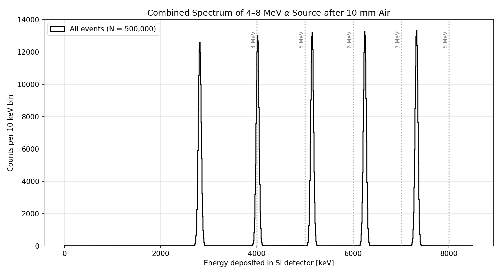
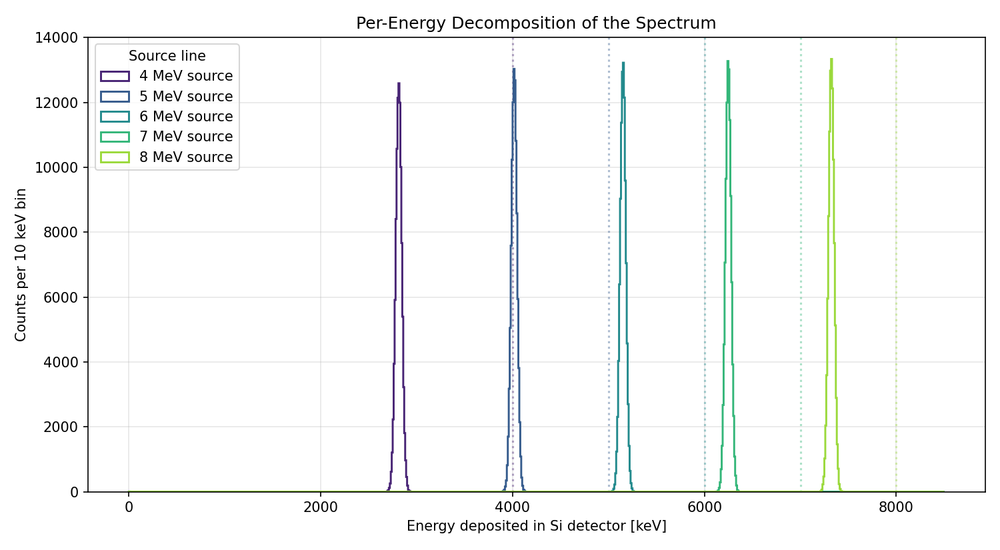
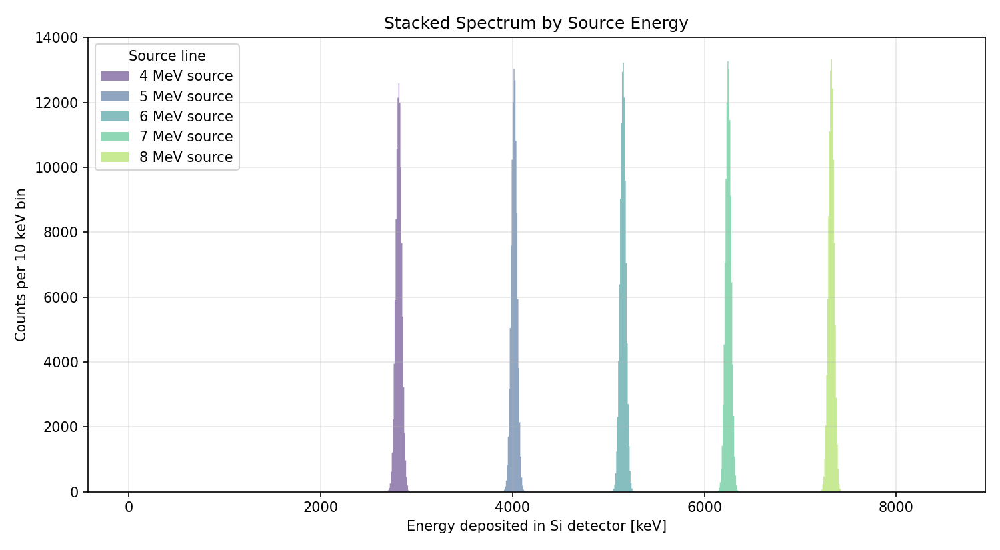

# Problem 3 — Spectrum of a Mixed 4–8 MeV Alpha Source in Air

Simulation of the energy spectrum recorded by a silicon detector when a point alpha source — emitting equally at 4, 5, 6, 7, and 8 MeV — sits 10 mm away in air. Each event picks one of the five energies uniformly at random; total statistics ≈ 10⁵ alphas per source line.

## Geometry

- **World:** Air-filled box, 50 × 50 × 30 mm (full extents).
- **Source:** Point at z = -5 mm on the world axis, alphas emitted along +z.
- **Air gap:** 10 mm between source and detector front face.
- **Detector:** Silicon slab, 20 × 20 × 0.1 mm (100 µm thick — comfortably thicker than the 8 MeV alpha range in Si of ~47 µm, so each alpha is fully stopped and its full residual energy is deposited).
- **Physics:** `FTFP_BERT` with `G4EmStandardPhysics_option4`.

The primary generator picks a random energy from `{4, 5, 6, 7, 8} MeV` (uniform) per event. The event action records both the per-event energy deposit in Si and the source energy of the primary, so the combined spectrum can be decomposed by source line in post.

## Building the Project

```bash
mkdir -p build
cd build
cmake ..
make -j$(nproc)
```

## Running the Simulation

### Batch Mode

```bash
./build/problem_3 run.mac
```

The macro fires 500,000 alphas (≈ 10⁵ per source line) and writes
`results/spectrum_nt_spectrum.csv` with two columns per event:

```
# edep_keV, e_source_MeV
2789.4, 4
4012.7, 5
...
```

### Interactive Mode (Visualization)

```bash
./build/problem_3
```

## Results

Each source line produces a Gaussian-like peak in the silicon detector, shifted *below* the source energy by the energy lost in 10 mm of air. Lower-energy alphas lose more (because dE/dx ~ 1/v²).

| Source [MeV] | Mean Edep [keV] | FWHM [keV] | Air loss [keV] |
|-------------:|----------------:|-----------:|---------------:|
| 4            | 2,813           | 75         | 1,187          |
| 5            | 4,016           | 94         | 984            |
| 6            | 5,151           | 101        | 849            |
| 7            | 6,248           | 115        | 752            |
| 8            | 7,322           | 138        | 678            |

### Combined Spectrum

The five source lines appear as well-separated peaks. Dotted vertical lines mark the original source energies for reference; the measured peak always sits to the left of its source line.



### Per-Energy Decomposition

The same data colour-coded by which source energy produced each event.



### Stacked View



### Generating Plots

```bash
python3 plot_results.py
```

## Project Structure

- `src/`, `include/`: Simulation source code (snake_case convention).
- `main.cc`: Application entry point.
- `run.mac`: Batch macro (500,000 events).
- `init_vis.mac`, `vis.mac`: Visualization configuration.
- `plot_results.py`: Reads the ntuple CSV and produces all spectrum plots.
- `results/`: Output ntuple CSV and PNG plots.
